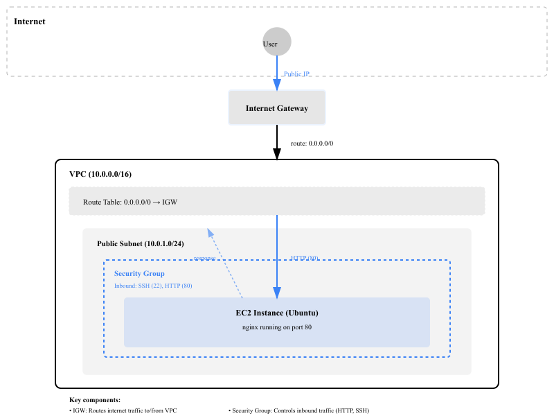
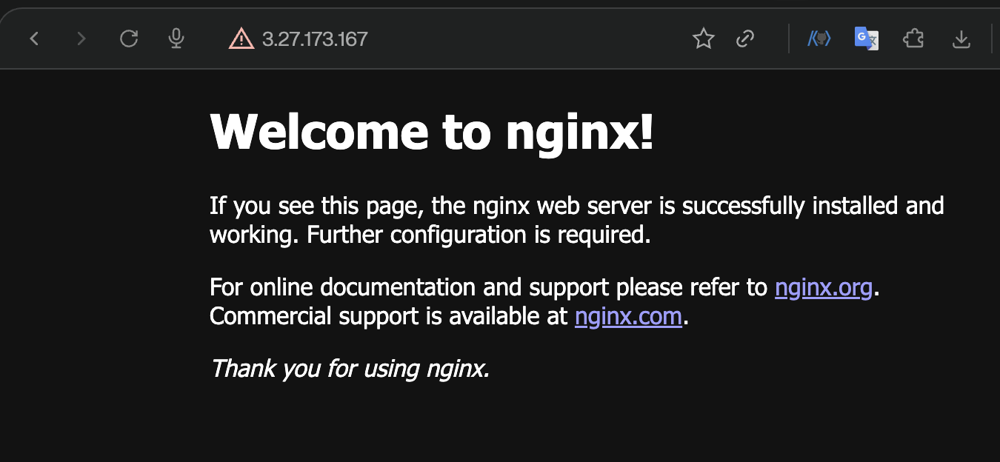
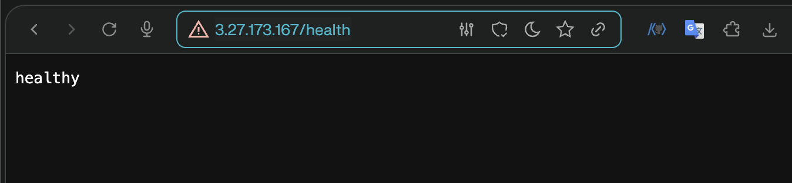

# 0. Architecture


# 1. IAM
이 과제는 최소권한 원칙을 위해 root 계정이 아닌 `IAM 사용자`를 만들어서 권한을 부여하고 실습한다.

### 0. 로그인

    IAM 계정을 만들기 위해서는 `root 계정으로 로그인` 해야한다.

### 1. 리전 확인하기

    로그인 후, `서울리전(northeast-2)`으로 바꿔준다.

### 2. `IAM 사용자` 만들기

- 사용자 생성

    `IAM` - `IAM 사용자` - `사용자 생성` - `사용자 이름` 입력 - `AWS Management Console에 대한 사용자 액세스 권한 제공` 클릭 - `콘솔암호(사용자 지정암호)` 입력

- 사용자 그룹 생성

    권한 옵션 - `그룹에 사용자 추가` - `그룹 생성` - `사용자 그룹 이름` 입력 - `권한 정책` 추가 (EC2, VPC) - `사용자 그룹 생성` 클릭

- `ARN` 번호 확인

    이 번호는 IAM 사용자 로그인 시 `accountID` 칸에 입력해야하므로 IAM사용자 대시보드에서 생성된 계정을 클릭하고 요약 탭에서 확인한다.

    ```text
    # 아래에서 ARN 정보에서 accountID는 123412341234 이다.

    arn:aws:iam::123412341234:user/codyssey-aws-study
    ```

### 3. 로그인 하기
- accountID : # ARN 에서 추출한 숫자 입력
- username : # IAM 계정 생성 시 입력한 ID 값
- passwd : # IAM 계정 생성 시 입력한 PASSWORD 값


<br>

# 2. VPC (Virtual Private Cloud)

### 1. VPC 생성
`VPC` - `VPC 생성` - `생성할 리소스`(VPC만) - 이`름 태그`(원하는 이름 입력) - `IPv4 CIDR 블록`(수동 입력) - 기타 기본 값 유지 - `VPC 생성` 클릭

### 2. Subnet 생성
`VPC` - `서브넷` - `서브넷 생성` - `VPC ID` (방금 만든 VPC 이름 클릭) - `서브넷 이름` (원하는 이름 입력) - `가용 영역` (서울리전의 한 영역 클릭) - IPv4 VPC CIDR* 블록 (10.0.0.0/16) - IPv4 서브넷 CIDR 블록(10.0.1.0/24, 10.0.2.0/24 => 보통 2개로 설정(가용영역 분산, 퍼블릭/프라이빗 분리)) - `서브넷 생성` 클릭

* `CIDR` 블록
: IP 주소범위를 나타내는 표기법

- 형식 : IP주소 / Prefix 길이
    ```text
    10.0.0.0/16
    IP 주소   / Prefix 길이 (앞 16비트는 고정)
    ```
- 예시
    - `10.0.0.0/16` = 10.0.0.0 ~ 10.0.255.255 (65,536개 주소)
    - `/24` = 더 작은 범위 (256개 주소)
    - `/32` = 1개 주소
- 관례
    네트워크 주소는 마지막이 0으로 끝나는 관례가 있음
    ```text
    10.0.0.0/24 (O)
    10.0.1.0/24 (O)
    10.0.0.5/24 (X - 잘못된 표기)
    ```

<br>

# 3. Internet Gateway 연결

`VPC` - `Internet gateways` 선택 - `인터넷 게이트웨이 생성` 클릭 - `이름 태그`(원하는 이름으로 입력) - `생성` - 생성된 IGW 선택 - `사용 가능한 VPC`(만들어둔 VPC 선택) -
`인터넷 게이트웨이 연결` 클릭 - 연결 완료

<br>

# 4. Route Table 설정

`VPC` - `Route tables` 선택 - `route table 생성` - `VPC` 선택 - `생성`

방금 만든 Route Table 선택 - `라우팅 편집` - `라우팅 추가` - `대상` (0.0.0.0/0 입력) - `Target` (Internet Gateway 선택) - `저장`

방금 만든 라우트 테이블 선택 - `작업` - `서브넷 편집` - 방금 만든 public subnet 2개 체크 - `연결 저장`

<br>

# 5. Security Group 생성

`EC2` - `Security Groups`(보안 그룹) - `보안 그룹 생성` - `Security group name` (원하는 이름 입력) - `Description` (설명 입력) - `VPC`(방금 만든 VPC 선택) - `인바운드 규칙` - `규칙 추가` - `SSH`(TCP / 22 / 소스 : 내 IP), `HTTP` (TCP / 80 / 소스 : Anywhere-IPv4) - `보안그룹 생성`

<br>

# 6. EC2 인스턴스 생성

EC2 - Instances - 인스턴스 시작 - 이름 및 태그 (원하는 이름 입력) - 애플리케이션 및 OS 이미지(AMI: Ubuntu LTS) - 인스턴스 유형 (t3.micro 또는 프리티어 사용가능한 유형으로 선택) - Key pair (새로 생성, 이름 입력, RSA, .pem) - Network settings - VPC (방금 만든 VPC) - Subnet (public subnet) -
퍼블릭 IP 자동할당 (활성화) - Security group (방금 만든 시큐리티 그룹) - 인스턴스 시작 클릭

<br>

# 7. 인스턴스에 SSH 접속

`EC2` - `Instances` - 방금 만든 인스턴스 선택 - `연결` - `SSH 클라이언트 내부` - 권한 부여 명령어와 SSH 접속 명령어 확인

SSH 클라이언트 열기 (내 로컬 터미널을 뜻함) - `.pem key`가 저장된 곳으로 이동 - 권한부여 (chmod 400 "my-key-pair.pem") - 퍼블릭 IP를 사용해서 인스턴스 연결 (ssh -i "my-key-pair.pem" ubuntu@퍼블릭IP)

<br>

# 8. 웹 서버 설치 및 실행 (Ubuntu 기준)
7번에서 SSH에 접속되면 서버 안에서 웹 서버(nginx) 설치

```bash
# 1. 패키지 업데이트
sudo apt update

# 2. nginx 설치
sudo apt install nginx

# 3. nginx 시작
sudo systemctl start nginx

# 4. 상태 확인
sudo systemctl status nginx

# 5. localhost 접속 테스트 (sudo 불필요)
curl http://localhost
```

```text
# nginx의 index 파일 내용
<!DOCTYPE html>
<html>
<head>
<title>Welcome to nginx!</title>
<style>
html { color-scheme: light dark; }
body { width: 35em; margin: 0 auto;
font-family: Tahoma, Verdana, Arial, sans-serif; }
</style>
</head>
<body>
<h1>Welcome to nginx!</h1>
<p>If you see this page, the nginx web server is successfully installed and
working. Further configuration is required.</p>

<p>For online documentation and support please refer to
<a href="http://nginx.org/">nginx.org</a>.<br/>
Commercial support is available at
<a href="http://nginx.com/">nginx.com</a>.</p>

<p><em>Thank you for using nginx.</em></p>
</body>
</html>
```

인스턴스 내부에서 localhost 접속이 성공해야 함
curl http://localhost 에서 200 응답이 나와야 함

<br>

# 9. 외부 접속 테스트

EC2 인스턴스 상세 화면에서 Public IPv4 address 확인

- 브라우저에서 확인 `http://퍼블릭IP`

    

- 브라우저에서 확인 `http://퍼블릭IP/health`
    정상 화면 또는 200 OK 확인
    
    

<br>

# 10. 마지막 정리

- [ ] EC2 인스턴스 종료
- [ ] EBS 볼륨 삭제
- [ ] Elastic IP 해제
- [ ] Internet Gateway 분리 후 삭제
- [ ] VPC 삭제
- [ ] Billing Dashboard 확인
