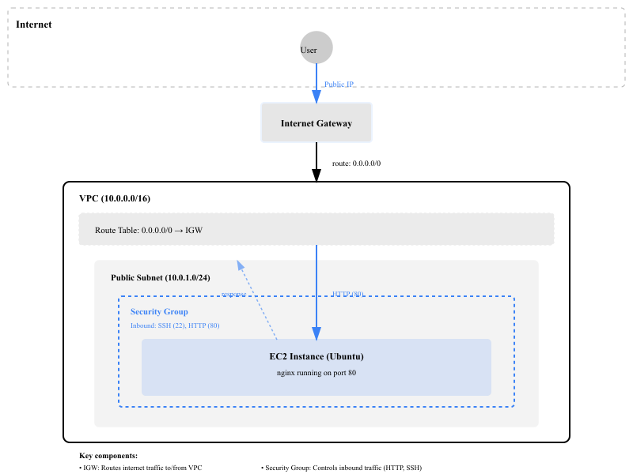
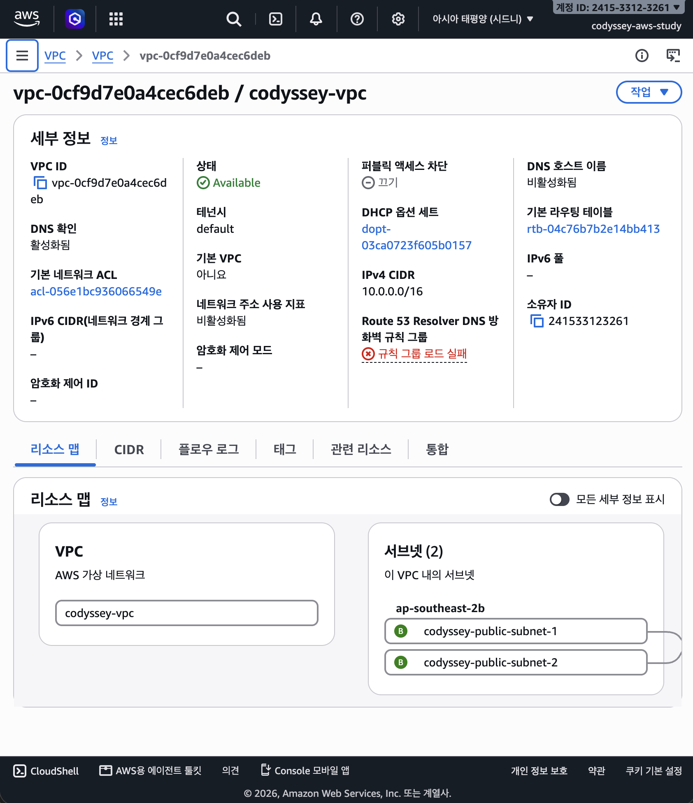
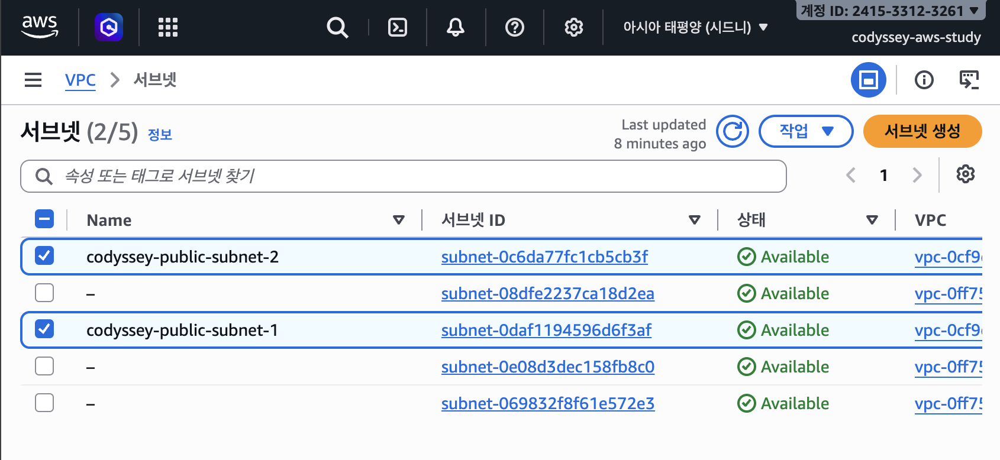
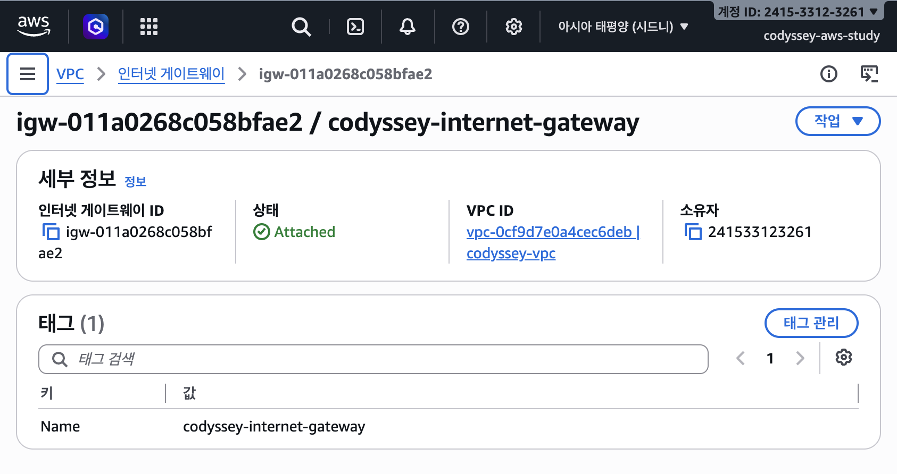
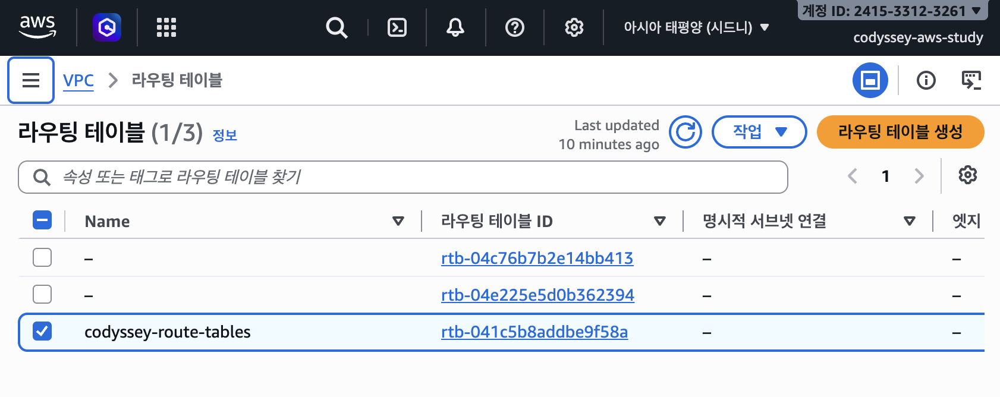
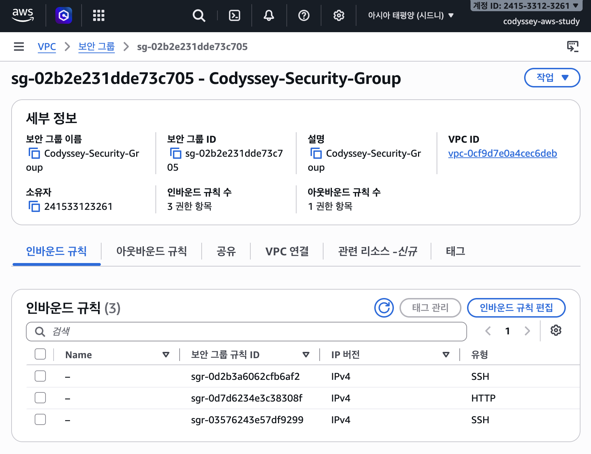
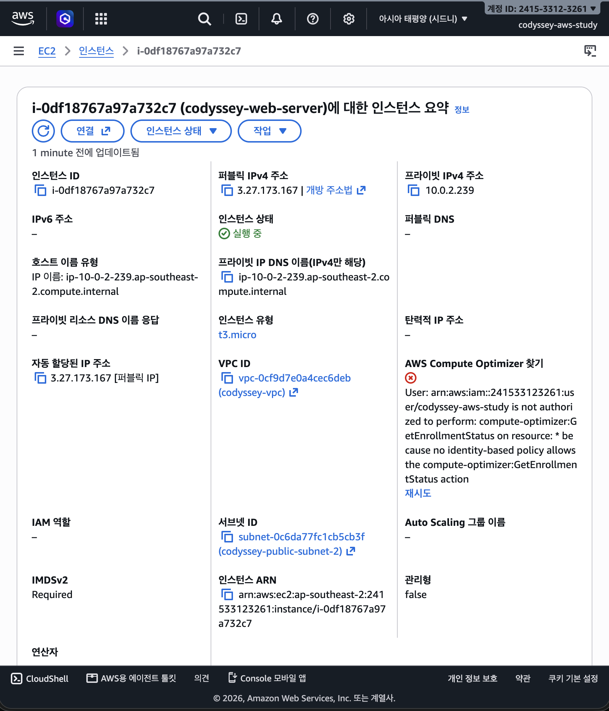

# 0. Architecture


## 아키텍처 구성도

```
┌─────────────────────────────────────────────────────────┐
│                    인터넷 (Internet)                      │
└────────────────────────┬────────────────────────────────┘
                         ↓
            ┌─────────────────────────────┐
            │   Internet Gateway (IGW)    │ ← 인터넷 현관
            └────────────┬────────────────┘
                         ↓
      ┌──────────────────────────────────────┐
      │         VPC (10.0.0.0/16)            │ ← 개인 네트워크
      │  ┌──────────────┐  ┌──────────────┐ │
      │  │ Public Subnet│  │Public Subnet │ │ ← 인터넷 연결됨
      │  │(10.0.1.0/24) │  │(10.0.2.0/24) │ │
      │  │              │  │              │ │
      │  │ ┌──────────┐ │  │ ┌──────────┐ │ │
      │  │ │EC2+Nginx │ │  │ │EC2+Nginx │ │ │ ← 웹 서버
      │  │ └──────────┘ │  │ └──────────┘ │ │
      │  │ Security Grp │  │ Security Grp │ │ ← 방화벽
      │  └──────────────┘  └──────────────┘ │
      │         ↑                 ↑          │
      │      (Route Table: 0.0.0.0/0 → IGW) │ ← 경로 설정
      │                                      │
      └──────────────────────────────────────┘
```

<br>

## 전체 설정 플로우

```
┌─────────────────────────────────────────────────────────────┐
│  1. IAM 사용자 생성 (보안)                                      │
│     Root 계정 → IAM 사용자 생성 → 권한 부여                       │
└─────────────────────────┬───────────────────────────────────┘
                          ↓
┌─────────────────────────────────────────────────────────────┐
│  2. VPC + Subnet 생성 (네트워크 영역)                            │
│     VPC (10.0.0.0/16) → Subnet1 (10.0.1.0/24)               │
│                       → Subnet2 (10.0.2.0/24)               │
└─────────────────────────┬───────────────────────────────────┘
                          ↓
┌─────────────────────────────────────────────────────────────┐
│  3. Internet Gateway 생성 (인터넷 연결)                         │
│     IGW 생성 → VPC에 연결                                      │
└─────────────────────────┬───────────────────────────────────┘
                          ↓
┌─────────────────────────────────────────────────────────────┐
│  4. Route Table 설정 (경로 지정)                               │
│     0.0.0.0/0 → Internet Gateway                            │
│     Subnet과 Route Table 연결                                 │
└─────────────────────────┬───────────────────────────────────┘
                          ↓
┌─────────────────────────────────────────────────────────────┐
│  5. Security Group 생성 (방화벽)                               │
│     인바운드: SSH(22), HTTP(80) 열기                           │
│     아웃바운드: 기본값(모든 포트 허용)                              │
└─────────────────────────┬───────────────────────────────────┘
                          ↓
┌─────────────────────────────────────────────────────────────┐
│  6. EC2 인스턴스 생성 (서버)                                    │
│     VPC, Subnet, Security Group 연결                         │
│     Key pair 생성 & 저장                                      │
└─────────────────────────┬───────────────────────────────────┘
                          ↓
┌─────────────────────────────────────────────────────────────┐
│  7. SSH 접속 (원격 접속)                                        │
│     내 컴퓨터 → EC2 인스턴스                                     │
└─────────────────────────┬───────────────────────────────────┘
                          ↓
┌─────────────────────────────────────────────────────────────┐
│  8-9. Nginx 설치 & 테스트                                      │
│     localhost 접속 확인 → 퍼블릭 IP로 외부 접속 확인                │
└─────────────────────────┬───────────────────────────────────┘
                          ↓
┌─────────────────────────────────────────────────────────────┐
│  10. 리소스 삭제 (정리)                                         │
│     EC2 → Route Table → IGW → VPC 순서로 삭제                  │
└─────────────────────────────────────────────────────────────┘
```

<br>


# 1. IAM
: AWS 리소스에 접근할 수 있는 권한을 관리하는 시스템

이 과제는 최소권한 원칙을 위해 root 계정이 아닌 `IAM 사용자`를 만들어서 권한을 부여하고 실습한다.
- 사용 계정: 별도 생성한 IAM 사용자
- AdministratorAccess 미사용
- 사용 권한: EC2 및 VPC 구성에 필요한 권한으로 제한

<br>

### 0. 로그인

IAM 계정을 만들기 위해서는 `root 계정으로 로그인` 해야한다.


### 1. 리전 확인하기

로그인 후, 과제 요구사항인 `서울리전(northeast-2)`으로 바꿔준다.


### 2. `IAM 사용자` 만들기

- 사용자 생성

    `IAM` - `IAM 사용자` - `사용자 생성` - `사용자 이름` 입력 - `AWS Management Console에 대한 사용자 액세스 권한 제공` 클릭 - `콘솔암호(사용자 지정암호)` 입력

- 사용자 그룹 생성

    권한 옵션 - `그룹에 사용자 추가` - `그룹 생성` - `사용자 그룹 이름` 입력 - `권한 정책` 추가 (EC2, VPC) - `사용자 그룹 생성` 클릭

- `ARN` 번호 확인

    이 번호는 IAM 사용자 로그인 시 `accountID` 칸에 입력해야하므로 IAM사용자 대시보드에서 생성된 계정을 클릭하고 요약 탭에서 확인한다.

    ```text
    # 아래에서 ARN 정보에서 accountID는 123412341234 이다.

    arn:aws:iam::123412341234:user/codyssey-aws-study
    ```

### 3. IAM 사용자로 로그인 하기
- accountID : # ARN 에서 추출한 숫자 입력
- username : # IAM 계정 생성 시 입력한 ID 값
- passwd : # IAM 계정 생성 시 입력한 PASSWORD 값


<br>


# 2. VPC (Virtual Private Cloud)
AWS 클라우드 안에 만드는 개인 네트워크 공간. 집 처럼, 외부로부터 격리된 자신만의 영역을 구성한다.

<br>

### 1. VPC 생성
`VPC` - `VPC 생성` - `생성할 리소스`(VPC만) - 이`름 태그`(원하는 이름 입력) - `IPv4 CIDR 블록`(수동 입력) - 기타 기본 값 유지 - `VPC 생성` 클릭



### 2. Subnet 생성
VPC를 더 작은 네트워크로 분할한 것. VPC라는 큰 집을 방(Subnet)으로 나누는 것처럼, 목적에 따라 여러 개의 작은 네트워크로 구분한다.

**퍼블릭 서브넷** vs **프라이빗 서브넷**
- 퍼블릭: Route Table을 통해 Internet Gateway로 나감 → 인터넷 사용자 접속 가능
- 프라이빗: 인터넷과 직접 연결 안 됨 → 데이터베이스 같은 내부 리소스 배치

`VPC` - `서브넷` - `서브넷 생성` - `VPC ID` (방금 만든 VPC 이름 클릭) - `서브넷 이름` (원하는 이름 입력) - `가용 영역` (서울리전의 한 영역 클릭) - IPv4 VPC CIDR* 블록 (10.0.0.0/16) - IPv4 서브넷 CIDR 블록(10.0.1.0/24, 10.0.2.0/24 => 보통 2개로 설정(가용영역 분산, 퍼블릭/프라이빗 분리)) - `서브넷 생성` 클릭



* `CIDR` 블록
: IP 주소범위를 나타내는 표기법

- 형식 : IP주소 / Prefix 길이
    ```text
    10.0.0.0/16
    IP 주소   / Prefix 길이 (앞 16비트는 고정)
    ```
- 예시
    - `10.0.0.0/16` = 10.0.0.0 ~ 10.0.255.255 (65,536개 주소)
    - `/24` = 더 작은 범위 (256개 주소)
    - `/32` = 1개 주소
- 관례
    네트워크 주소는 마지막이 0으로 끝나는 관례가 있음
    ```text
    10.0.0.0/24 (O)
    10.0.1.0/24 (O)
    10.0.0.5/24 (X - 잘못된 표기)
    ```

<br>

# 3. Internet Gateway 연결
VPC가 인터넷과 통신할 수 있게 해주는 관문. 집의 현관문처럼, 이것이 없으면 집 안(VPC)에서 바깥(인터넷)과 연결할 수 없다.

`VPC` - `Internet gateways` 선택 - `인터넷 게이트웨이 생성` 클릭 - `이름 태그`(원하는 이름으로 입력) - `생성` - 생성된 IGW 선택 - `사용 가능한 VPC`(만들어둔 VPC 선택) -
`인터넷 게이트웨이 연결` 클릭 - 연결 완료



<br>

# 4. Route Table 설정
네트워크 트래픽의 경로를 정해주는 규칙집. 편지를 보낼 때 주소에 따라 배송 경로가 달라지는 것처럼, 데이터가 어디로 가야 하는지 가르쳐준다.

**핵심 규칙:**
- `0.0.0.0/0` = "모든 외부 트래픽"을 의미
- `Target: Internet Gateway` = "Internet Gateway로 보낸다"는 뜻
- 이 설정이 있어야 Subnet이 **퍼블릭 서브넷**이 됨

**단계별 진행:**

1️⃣ Route Table 생성
```
`VPC` - `Route tables` 선택 - `route table 생성` - `VPC` 선택 - `생성`
```

2️⃣ 라우팅 규칙 추가
```
방금 만든 Route Table 선택 - `라우팅 편집` - `라우팅 추가` 
- 대상(Destination): 0.0.0.0/0 입력
- Target: Internet Gateway 선택 - `저장`
```

3️⃣ Subnet과 Route Table 연결
```
방금 만든 라우트 테이블 선택 - `작업` (또는 한글로 `서브넷 편집`) 
- 방금 만든 public subnet 2개 체크 - `연결 저장`
```

>  **주의:** 이 연결이 없으면 Subnet이 프라이빗이 되어 외부 접속 불가


<br>

# 5. Security Group 생성
- HTTP 80: `0.0.0.0/0` 허용
- SSH 22: 개인 IP만 허용
- 전체 포트 허용 규칙 없음

`EC2` - `Security Groups`(보안 그룹) - `보안 그룹 생성` - `Security group name` (원하는 이름 입력) - `Description` (설명 입력) - `VPC`(방금 만든 VPC 선택) - `인바운드 규칙` - `규칙 추가` - `SSH`(TCP / 22 / 소스 : 내 IP), `HTTP` (TCP / 80 / 소스 : Anywhere-IPv4) - `보안그룹 생성`



<br>

# 6. EC2 인스턴스 생성
- 리전: 서울 `ap-northeast-2`
- 인스턴스: EC2 micro급
- 운영체제: Ubuntu LTS
- 웹 서버: Nginx

클라우드에서 빌려 쓰는 가상 서버(컴퓨터). 이것을 통해 웹 서버 등 원하는 프로그램을 실행할 수 있다.

**중요 설정 항목:**

| 항목 | 설정값 | 이유 |
|------|--------|------|
| **OS 이미지** | Ubuntu LTS | 초보자 친화적, 무료 |
| **인스턴스 타입** | t3.micro | AWS 프리티어 무료 |
| **Key pair** | 새로 생성 (.pem) | SSH 접속 시 필수 (분실 시 복구 불가) |
| **VPC** | 방금 만든 VPC | 네트워크 격리 |
| **Subnet** | Public Subnet | 외부 접속 가능 |
| **퍼블릭 IP** | 활성화 | 브라우저에서 접속 가능 |
| **Security Group** | 방금 만든 것 | SSH(22), HTTP(80) 포트 허용 |

**설정 경로:**
```
EC2 - Instances - 인스턴스 시작 
→ 이름 및 태그 (원하는 이름 입력) 
→ 애플리케이션 및 OS 이미지 (Ubuntu LTS 선택) 
→ 인스턴스 유형 (t3.micro 선택) 
→ Key pair (새로 생성 - 매우 중요!) 
→ Network settings
  - VPC: 방금 만든 VPC 선택
  - Subnet: public subnet 선택
  - 퍼블릭 IP 자동할당: 활성화
  - Security group: 방금 만든 그룹 선택
→ 인스턴스 시작 클릭
```

> **Key pair 저장:** .pem 파일을 안전한 곳에 저장해야한다. ( 분실하면 인스턴스에 접속할 수 없음)


<br>

# 7. 인스턴스에 SSH 접속
원격 컴퓨터(EC2 인스턴스)에 안전하게 접속하는 방식. 내 컴퓨터에서 클라우드의 서버로 접속해서 명령어를 실행할 수 있다.

**AWS 콘솔에서 접속 명령어 확인:**
```
EC2 - Instances 
→ 방금 만든 인스턴스 선택 
→ 오른쪽 위의 "연결" 버튼 클릭 
→ "SSH 클라이언트" 탭 
→ 보이는 명령어들을 복사 (예: chmod 명령어, ssh 명령어)
```

**내 로컬 터미널에서 실행 (Mac/Linux 기준):**

1️⃣ .pem 키가 있는 디렉토리로 이동
```bash
cd ~/Downloads  # 또는 .pem 파일이 있는 경로
```

2️⃣ 키 파일 권한 설정 (처음 한 번만)
```bash
chmod 400 "my-key-pair.pem"  # AWS에서 제공한 파일명 사용
```

3️⃣ SSH 접속
```bash
ssh -i "my-key-pair.pem" ubuntu@<퍼블릭IP>
```
퍼블릭 IP는 EC2 인스턴스 상세 페이지에서 확인 (예: 12.34.56.78)

> **성공 신호:** `ubuntu@ip-xxx:~$` 프롬프트가 보이면 성공!

<br>

# 8. 웹 서버 설치 및 실행 (Ubuntu 기준)
Nginx는 인터넷 사용자들의 요청을 받아서 웹 페이지를 보여주는 웹 서버 프로그램. 7번에서 SSH에 접속된 EC2 인스턴스에 이를 설치한다.

**7번에서 SSH 접속된 터미널에서 실행:**

```bash
# 1. 패키지 목록 업데이트 (새로운 소프트웨어 정보 받기)
sudo apt update

# 2. nginx 설치
sudo apt install nginx

# 3. nginx 시작
sudo systemctl start nginx

# 4. nginx 상태 확인 (active 라고 보이면 성공)
sudo systemctl status nginx

# 5. localhost에서 접속 테스트 (EC2 내부에서만 가능)
curl http://localhost
```

**예상 결과:**
- `curl http://localhost` 명령어가 HTML 코드를 출력하면 ✅ 성공
- 또는 `<html>`, `Welcome to nginx!` 텍스트가 보이면 ✅ 성공


```text
# nginx의 index 파일 내용
<!DOCTYPE html>
<html>
<head>
<title>Welcome to nginx!</title>
<style>
html { color-scheme: light dark; }
body { width: 35em; margin: 0 auto;
font-family: Tahoma, Verdana, Arial, sans-serif; }
</style>
</head>
<body>
<h1>Welcome to nginx!</h1>
<p>If you see this page, the nginx web server is successfully installed and
working. Further configuration is required.</p>

<p>For online documentation and support please refer to
<a href="http://nginx.org/">nginx.org</a>.<br/>
Commercial support is available at
<a href="http://nginx.com/">nginx.com</a>.</p>

<p><em>Thank you for using nginx.</em></p>
</body>
</html>
```

- 인스턴스 내부 검증: `curl http://localhost` → HTTP 200
- 아웃바운드 검증: `curl https://example.com` 성공
- 외부 접속 검증: `http://3.27.173.167` 접속 및 정상 화면 확인
- 헬스체크 검증: `http://3.27.173.167/health` 접속 및 정상 응답 확인

<br>

